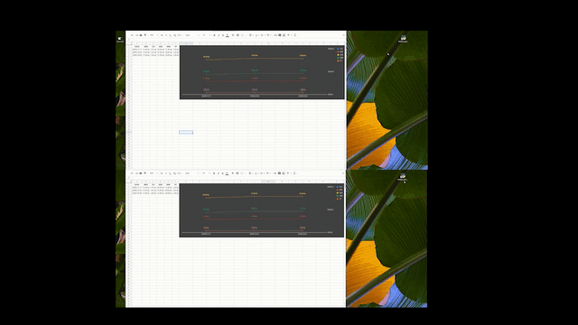

## Retrieve BVB Shares Prices and add them to an existing Google Sheets spreadsheet using Python
Retrieve the share prices from the Bucharest Stock Exchange website (bvb.ro - Bursa de Valori Bucuresti) and save the retrieved values in an existing Google Sheets spreadsheet, using Python, Google Sheets API, Google Drive API, EZSheets (external module) and Selenium. 
 
The working environment was set up following the steps in Chapter 14 of Automate the Boring Stuff with Python (https://automatetheboringstuff.com/2e/chapter14/), author's Github profile: https://github.com/asweigart/readal.

 

  
### May Update

I've added a new functionality to the Python script. On top of adding the saved share prices to a specific cell in Google Sheets, now the script also saves all the prices in a separate sheet after finding the last used row of the table, and populates those results in a chart. 

Since Google doesn't offer a straighforward way of finding the last used row from a range of their sheets (like Microsoft does through VBA), the last row is found using a loop that goes through each cell of the table until an empty cell is found. Not the most elegant solution once you start looping through thousands of rows, but it gets the job done nevertheless. 

  *The recording was speed up. Real time runtime is slower.
### June Update - Thread-based parallelism
I've now modified the source code so that it no longer waits for the scraping part to be completed in order to login to Google Sheets' platform. Generating two threads that work in parallel (one for the scraping part and one for the logging in and data saving in the spreadhseet part) speed up the total run time by <b>more than 40%.</b>

This was a great exercise and a very basic example of implementing Python's threading module in a project. I'd argue that every project that has a lot of I/O or Network usage should implement a threading solution asap.

 

